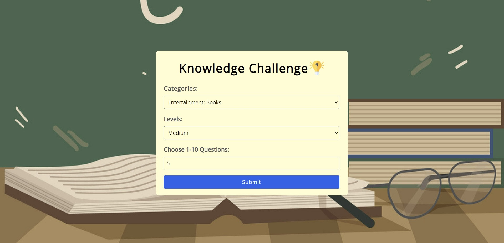

# React Quiz App with Tailwind CSS

This is a simple quiz application built using React.js and styled with Tailwind CSS. It fetches quiz data from the Open Trivia Database API and allows users to answer questions, providing a delightful experience for knowledge enthusiasts.



## Features

- filter and explore quizzes by category and difficulty.
- Choose the number of questions (1-10) for your quiz.
- Answer trivia questions and receive immediate feedback.
- Reset the quiz and start over at any time.

## Technologies Used

- React.js
- Tailwind CSS
- Axios for API requests

## Usage

1. Clone the repository to your local machine:

   ```bash
   git clone https://github.com/Ana-1995/quiz-app.git